# workspace-py

<p align="center">
  
</p>

<p align="center">
  <em>Um espaço só meu para estudar Python — seja seguindo cursos formais, seja construindo minha própria trilha do zero.</em>
</p>

---

## 📌 Sobre este repositório

Este repositório reúne tudo que envolve **aprendizado de Python**, dividido em duas frentes:

- Cursos que estou **fazendo** em instituições de ensino
- Uma trilha que estou **construindo aos poucos**, com apoio de IA, começando do básico e avançando conforme os tópicos forem surgindo

Não existe um roteiro fechado aqui. Este é um repositório **vivo**: ele cresce conforme os cursos avançam e conforme novos assuntos entram na trilha de estudos. Pense nele menos como um portfólio pronto e mais como um diário de progresso.

---

## 🗂️ Estrutura

```
workspace-py/
├── assets/
│   └── main/
│       └── terminal.svg
├── coursework/
└── learning-path/
```

### [`coursework/`](./coursework)

Aqui ficam os conteúdos de cursos que estou cursando de fato em instituições (como IFMG, IFRS, entre outras). Cada curso tem sua própria pasta, e a organização interna (módulos, categorias etc.) é definida assim que aquele curso específico começa — já que cada instituição estrutura o conteúdo de um jeito diferente.

### [`learning-path/`](./learning-path)

Minha trilha autodidata, construída de forma progressiva, começando pelos fundamentos de Python e se ramificando em tópicos mais específicos conforme o tempo passa. Cada fase só é criada quando realmente começa.

---

## 📎 Convenções

- Nomes de pastas e arquivos ficam sempre em **inglês**, independente do idioma usado no conteúdo ou nas anotações.
- Cada README criado dentro deste repositório segue o mesmo padrão visual: uma introdução animada, guardada em `assets/`.
- Este repositório reflete **progresso, não um produto finalizado** — atualizações acontecem conforme o aprendizado avança.
