# 🐍 freeCodeCamp — Certificação em Python

Minhas anotações, práticas e projetos da certificação em Python do freeCodeCamp.

---

## 👋 Sobre

Esta pasta faz parte do [`workspace-py`](../../README.md) e reúne tudo o que eu produzo enquanto faço a certificação em Python do freeCodeCamp. Estou começando pelos fundamentos, então o objetivo aqui é registrar o caminho: o que aprendi, o que pratiquei e o que construí.

## 🗂️ Estrutura

| Pasta | O que tem |
| --- | --- |
| [`notes/`](notes/) | 📝 Uma nota por aula, escrita por mim, organizada por módulo |
| [`practice/`](practice/) | 🛠️ Código das oficinas e dos exercícios de prática |
| [`projects/`](projects/) | 🚀 Os 5 projetos exigidos pela certificação, um por subpasta |

## 📝 Como as notas funcionam

- Um arquivo `.md` por aula, dentro da pasta do módulo correspondente (`notes/01-<module>/01-<topic>.md`).
- Conteúdo em português, nomes de pastas e arquivos em inglês.
- Código sempre em blocos de código do Markdown, com a linguagem indicada, para dar para copiar e testar.

## ✅ Progresso

- [ ] Módulos do curso
- [ ] Projeto 1
- [ ] Projeto 2
- [ ] Projeto 3
- [ ] Projeto 4
- [ ] Projeto 5

> Os nomes dos módulos e dos projetos entram aqui conforme eu avanço no curso.

## 🔗 Links

- 🏠 [Voltar ao `workspace-py`](../../README.md)
- 📚 [freeCodeCamp](https://www.freecodecamp.org/)
